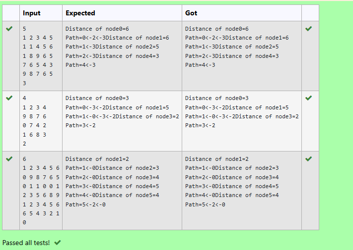

# Insert Elements at the Rear of the Deque

## Aim:
To implement a C program that inserts an element at the rear end of a double-ended queue (deque) while handling overflow and shifting conditions.

## Algorithm:
Start

Initialize a deque array and variables front and rear to -1.

Define addRear() function with parameters: deque array, item to insert, and pointers to front and rear.

Inside addRear():

If deque is full (front == 0 && rear == MAX - 1), print overflow message.

If deque is empty (front == -1), set both front and rear to 0 and insert the item.

If space is available at the rear (rear < MAX - 1), increment rear and insert item.

If rear is full but front > 0, shift elements left and insert item.

Display updated deque after insertion.

End

## Program:
```
/*#include <stdio.h>

#define MAX 10

void addFront(int *, int, int *, int *);
void addRear(int *, int, int *, int *);
int delFront(int *, int *, int *);
int delRear(int *, int *, int *);
void display(int *);
int count(int *);
*/
void addRear(int *arr, int item, int *pfront, int *prear) {
  int i;
  if (*pfront==0 && *prear==MAX-1){
      printf("deque is full");
      return;
  }
  
  if (*pfront==-1){
      *prear=*pfront=0;
      arr[*prear]=item;
      return;
  }
  
     if (*prear < MAX - 1) {
            // Normal case, space at rear
            (*prear)++;
            arr[*prear] = item;
        } 
    
    else {
        // Shift elements to left to free up rear space
        for (i = *pfront; i <= *prear; i++) {
            arr[i - 1] = arr[i];
        }
        (*pfront)--;
        // (*prear)--;
        // (*prear)++; optional in our case;
        arr[*prear] = item;
    }
  
}
```


## Output:

## Result:
The program successfully inserts elements at the rear of the deque and handles overflow and left-shifting scenarios as needed.

