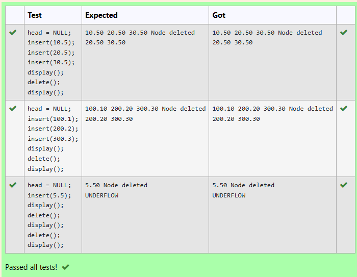

# 🧠 Double Linked List – Delete Function (C Language)
## 🎯 Aim
To write a program in C that deletes the first node from a double linked list and displays the updated list.
It should also handle:

If the list is empty (print "UNDERFLOW")

If there's only one element

If there are multiple elements

## 🔧 What is a Double Linked List?
A Double Linked List is a special list of elements (called nodes) where:

Each node stores a number (float data)

It points to the next node and the previous node

Example:
```
NULL <- 10.5 <-> 20.5 <-> 30.5 -> NULL
```
## 💻 Code
```
struct Node
{
    struct Node *prev;
    struct Node *next;
    float data;
}*head;

void delete() {
    if (head == NULL) {
        printf("UNDERFLOW\n");
        return;
    }

    struct Node *temp = head;

    //  only one node exists
    if (head->next == NULL) {
        free(head);
        head = NULL;
        printf("Node deleted\n");
        return;
    }

    //  More than one node exists
    head = head->next;   // Move head to the next node
    head->prev = NULL;   // Update the new head's prev pointer
    free(temp);          // Free the old head

    printf("Node deleted \n");
}
```

## ✅ Output:

## 🧹 What Happens:
We insert 3 numbers: 10.5, 20.5, 30.5

The list looks like: 10.50 20.50 30.50

We delete the first node

The new list becomes: 20.50 30.50

## ⚠️ What if the list is empty?
Input:

```
head = NULL;
delete();
```
Output:
```
UNDERFLOW
```
Because there's nothing to delete!

## 📚 Conclusion
This program helps us learn how to manage memory and work with pointers in C.

Very useful for making real-world apps like text editors, browsers (forward/backward), and more!