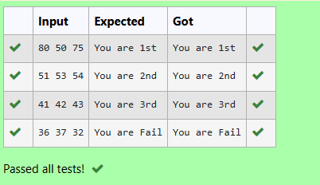

# Evaluating the given Prefix Expression
## Aim
Write a C function to evaluate a prefix expression using a stack.
The expression contains only digits and the operators + (addition) and * (multiplication).

Evaluate the prefix expression +9*26 and display the output inside the function.

## Algorithm
Start scanning the prefix expression from right to left.

Use a stack to store operands.

For each character:

If it's a digit, push it onto the stack.

If it's an operator:

Pop the top two operands from the stack.

Apply the operator on these operands.

Push the result back onto the stack.

After the loop ends, the stack will contain the final result.

Print the result.

## Program
```
#include<stdio.h>
#include<string.h>
#include<ctype.h>

int s[50];
int top=-1;

void push(int ch)
{
	top++;
	s[top]=ch;
}

int pop()
{
	int ch;
	ch=s[top];
	top=top-1;
	return(ch);
}

void evalprefix(char p[50])
{
   int num1,num2,result;
   int len=strlen(p);
   int e=len-1;
   while(e>=0){
       if (isdigit(p[e])){
           push(p[e]-'0');
       }
       else{
           num1=pop();
           num2=pop();
           if(p[e]=='+'){
               result=num1+num2;
           }
           if(p[e]=='*'){
               result=num1*num2;
           }
           push(result);
       }
       e--;
   }
   printf("%d\n",pop());
}
``` 
## Output

## Result
The program correctly evaluates the prefix expression +9*26 and outputs the result 21.