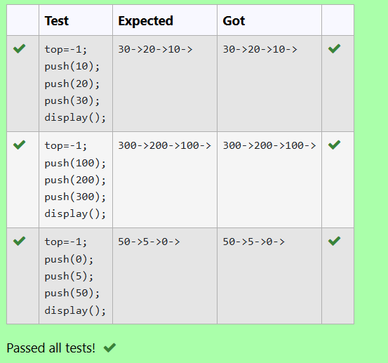

# Heapify Priority Queue Elements after Deletion (Max-Heap Property)

## Aim:
To develop a C program to heapify elements of a priority queue after deletion, following the max-heap property.

## Algorithm:
Start

Define a heapify function that:

Checks if the heap has only one element and prints a message accordingly.

Determines the largest among the root (i), left child (2i+1), and right child (2i+2).

Swaps the root with the largest child if needed and recursively calls heapify.

Define a swap function to interchange two values using pointers.

In the main() function:

Initialize an array representing the max-heap.

Accept the number of elements (size) and the array elements.

Simulate deletion by swapping the root with the last element.

Reduce the size of the heap and call heapify() starting from the root (index 0).

Display the heapified array after deletion.

End

## Program:
```
/*#include <stdio.h>
int size = 0;
*/
void heapify(int array[], int size, int i) {
   if (size == 1) {
    printf("Single element in the heap");
  } 
  else {
    int largest = i;
    int l = 2 * i + 1;
    int r = 2 * i + 2;
    if (l < size && array[l] > array[largest])
      largest = l;
    if (r < size && array[r] > array[largest])
      largest = r;

    if (largest != i) {
      swap(&array[i], &array[largest]);
      heapify(array, size, largest);
    }
  }
}
```

## Output:

## Result:
The program successfully heapifies the elements of the priority queue after deletion while maintaining the max-heap property.

