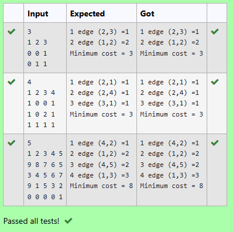

# 🧮 Kruskal's Algorithm in C
## 📌 Aim:
To write a C program to implement Kruskal's Algorithm to find the Minimum Cost Spanning Tree (MST) of a connected, undirected graph.

## 📚 Algorithm:
Input the number of vertices and the cost adjacency matrix of the graph.

Replace all 0s in the matrix (no edge) with a large number (e.g., 999) to simulate infinity.

Initialize the parent[] array for union-find operations.

Use a loop to find the smallest edge that doesn't form a cycle using the Union-Find method.

Include the edge in the MST and update the total cost.

Repeat until (number of vertices - 1) edges are added to the MST.

Display each selected edge and its cost.

Output the Minimum Total Cost.

## 🧾 Program:
```
#include <stdio.h>
#include <stdlib.h>

int i,j,k,a,b,u,v,n,ne=1;
int min,mincost=0,cost[9][9],parent[9];

int find(int i) {
    while(parent[i])
        i = parent[i];
    return i;
}

int uni(int i, int j) {
    if(i != j) {
        parent[j] = i;
        return 1;
    }
    return 0;
}

int main()
{
    scanf("%d",&n);
    for(i=1;i<=n;i++) {
        for(j=1;j<=n;j++) {
            scanf("%d",&cost[i][j]);
            if(cost[i][j]==0)
                cost[i][j]=999;
        }
    }

    while(ne < n) {
        for(i=1,min=999;i<=n;i++) {
            for(j=1;j<=n;j++) {
                if(cost[i][j] < min) {
                    min = cost[i][j];
                    a = u = i;
                    b = v = j;
                }
            }
        }

        u = find(u);
        v = find(v);

        if(uni(u, v)) {
            printf("%d edge (%d,%d) =%d\n", ne++, a, b, min);
            mincost += min;
        }

        cost[a][b] = cost[b][a] = 999;
    }

    printf("Minimum cost = %d\n", mincost);
    return 0;
}

```

## 📥 Output:

## ✅ Result / Conclusion:
The program successfully implements Kruskal's Algorithm to find the Minimum Spanning Tree of a graph. It selects the minimum cost edges while preventing cycles, ensuring the final spanning tree connects all nodes at the lowest possible cost.

This confirms the correctness and efficiency of the greedy approach used in Kruskal’s Algorithm, and it is suitable for sparse graphs where fewer edges are present.