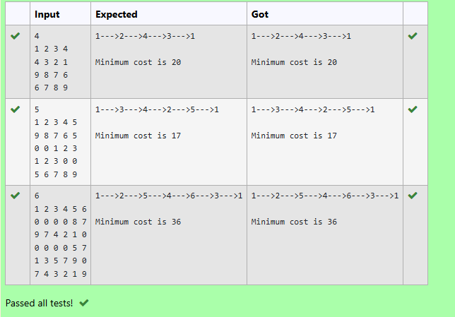

# 📚 Snow Howler the Librarian
Welcome to HuskyLand Library! 🐺
Snow Howler the librarian needs your help to manage books on different shelves.

## 📝 Task
You will write a program that can:

📥 Add a book with some number of pages to a shelf

📖 Find out how many pages a book has

📦 Count how many books are on a shelf

## 📥 Input Format
First line: an integer n — the number of shelves.

Second line: an integer q — the number of queries (or tasks).

The next q lines contain one of the following queries:

```
1 x y → Put a book with y pages on shelf x
2 x y → Show how many pages the y-th book on shelf x has
3 x   → Show how many books are on shelf x
```


## 💡 How It Works
You store books in a 2D array shelves[x][y]

You track how many books are in each shelf using book_counts[x]

When a query comes in, you:

Add a book

Print a book’s pages

Count books

## 🧑‍💻 Code
```
#include <stdio.h>
#include <stdlib.h>

#define MAX_SHELVES 100  // Maximum number of shelves
#define MAX_BOOKS 100    // Maximum number of books per shelf

int shelves[MAX_SHELVES][MAX_BOOKS]; // Store book pages
int book_counts[MAX_SHELVES] = {0};  // Track number of books in each shelf

int main() {
    int n, q;
    scanf("%d %d", &n, &q);  // Read number of shelves and queries

    for (int i = 0; i < q; i++) {
        int type, x, y;
        scanf("%d", &type);

        if (type == 1) {  
            // Add book with y pages to shelf x
            scanf("%d %d", &x, &y);
            shelves[x][book_counts[x]] = y;
            book_counts[x]++;
        } 
        else if (type == 2) {  
            // Print pages of book y in shelf x
            scanf("%d %d", &x, &y);
            printf("%d\n", shelves[x][y]);
        } 
        else if (type == 3) {  
            // Print number of books on shelf x
            scanf("%d", &x);
            printf("%d\n", book_counts[x]);
        }
    }
    return 0;
}

```
## ✅ Output

## 🧠 What You Learn
Using 2D arrays

Keeping count of items

Managing input and output

Handling real-world logic with code

