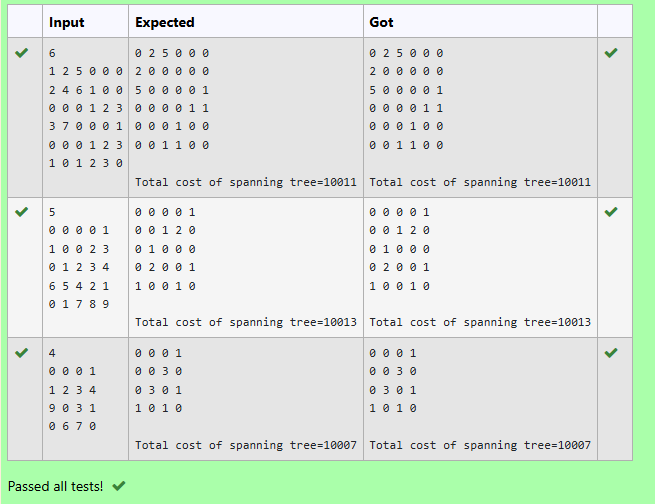

# Performing right rotation in AVL Tree
## 🏁 Aim
Write a C program to perform Right Rotation in an AVL Tree.

## 🔍 Algorithm
Read the number of elements n.

Read n elements and insert them into the AVL Tree using normal AVL insertion rules.

During insertion, check the Balance Factor (Bf).

If Balance Factor > 1 and the value is inserted in the left subtree of left child, perform a Right Rotation (LL case).

Update the height of affected nodes after the rotation.

Print the AVL Tree in preorder traversal with balance factors.

## 💻 Program
```
 
node * rotateright(node *x)
{
// type your code here

    node *y = x->left;
    x->left = y->right;
    y->right = x;
    x->ht = height(x);  // Update height of x
    y->ht = height(y);  // Update height of y
    return y;
}
```
## 📤 Output

## ✅ Result
The program correctly performs Right Rotation where needed in the AVL Tree and prints the tree in preorder format with balance factors after all insertions.